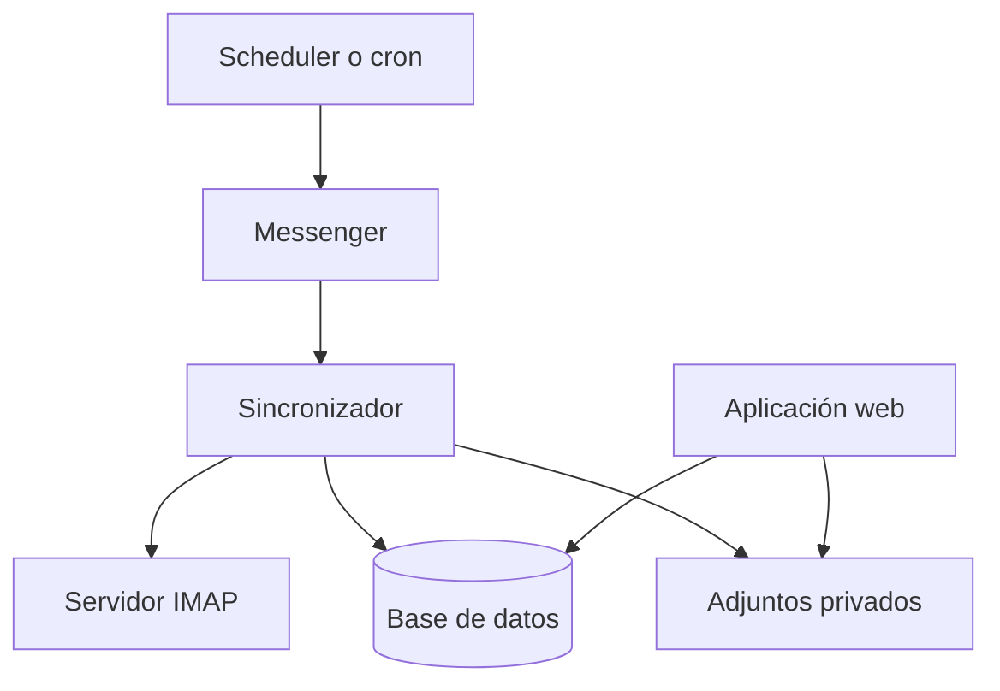

# 3. Arquitectura técnica

## 3.1 Enfoque

Easy Mail será un monolito modular Symfony. Esta solución reduce coste operativo y permite separar correctamente la web, la persistencia y la sincronización sin introducir microservicios prematuros.

## 3.2 Stack recomendado

- PHP 8.3 o superior compatible.
- Symfony 7.4 LTS.
- Doctrine ORM y Doctrine Migrations.
- PostgreSQL como opción preferida; MySQL 8 es compatible si el entorno lo requiere.
- Twig para renderizado en servidor.
- Symfony UX Stimulus para interacciones pequeñas sin construir una SPA.
- Symfony Security para autenticación y autorización.
- Symfony Messenger para trabajos asíncronos.
- Symfony Scheduler o cron para solicitar sincronizaciones periódicas.
- Transporte Doctrine de Messenger durante el MVP; Redis puede incorporarse si el volumen lo justifica.
- Almacenamiento privado local para adjuntos durante el MVP, abstraído para poder migrar a S3.

Se elige Symfony 7.4 por ser la versión LTS actual y por su soporte prolongado. La versión exacta de parche debe resolverse al instalar dependencias, no fijarse en la documentación.

## 3.3 Flujo general



La aplicación web nunca depende de una respuesta IMAP para renderizar una pantalla.

## 3.4 Capas

### Presentation

Incluye controladores, formularios, DTOs HTTP, templates Twig y componentes UX.

Responsabilidades:

- Interpretar la petición.
- Validar los datos de entrada.
- Comprobar autorización.
- Invocar un caso de uso.
- Construir la respuesta.

No contiene parsing MIME, consultas IMAP ni lógica de clasificación.

### Application

Contiene casos de uso y coordinación:

- Crear o editar un proyecto.
- Configurar y probar una cuenta.
- Solicitar una sincronización.
- Sincronizar una cuenta.
- Marcar un mensaje como revisado.
- Construir consultas de bandeja y secciones.

### Domain

Contiene entidades, enums, value objects y reglas propias de Easy Mail.

No debe depender de un cliente IMAP concreto.

### Infrastructure

Contiene:

- Repositorios Doctrine.
- Implementación IMAP.
- Cifrado de secretos.
- Almacenamiento de adjuntos.
- Logging y adaptadores externos.

## 3.5 Estructura orientativa

```text
src/
├── Controller/
│   ├── DashboardController.php
│   ├── ProjectController.php
│   ├── ProjectInboxController.php
│   ├── EmailMessageController.php
│   ├── InboxSectionController.php
│   ├── MailboxController.php
│   └── Admin/
├── Application/
│   ├── Project/
│   ├── Mailbox/
│   ├── Message/
│   └── Section/
├── Domain/
│   ├── Entity/
│   ├── Enum/
│   ├── ValueObject/
│   └── Contract/
├── Infrastructure/
│   ├── Doctrine/
│   ├── Mail/
│   │   └── Imap/
│   ├── Security/
│   └── Storage/
├── Message/
├── MessageHandler/
├── Form/
├── Security/Voter/
└── Twig/
```

Esta estructura es una guía. El agente puede simplificar carpetas vacías, pero debe mantener separados los límites externos y los casos de uso.

## 3.6 Controladores y rutas

| Controlador | Rutas aproximadas | Responsabilidad |
|---|---|---|
| `DashboardController` | `GET /` | Resumen global |
| `ProjectController` | `GET /projects`, `GET /projects/{slug}` | Listado y contexto de proyecto |
| `ProjectInboxController` | `GET /projects/{slug}/inbox` | Bandeja, búsqueda y filtros |
| `EmailMessageController` | `GET /projects/{slug}/messages/{id}` | Detalle y adjuntos |
| `MessageStateController` | `POST /messages/{id}/state` | Estado personal local |
| `InboxSectionController` | CRUD administrativo | Secciones personalizadas |
| `MailboxController` | CRUD, prueba y sincronización | Gestión administrativa de cuentas |
| `UserController` | CRUD administrativo | Usuarios y membresías |

Las mutaciones deben usar POST, PUT/PATCH o DELETE con protección CSRF. No se muta estado mediante GET.

## 3.7 Servicios y contratos principales

```php
interface MailProviderInterface
{
    public function test(MailboxConnection $connection): ConnectionTestResult;

    public function getMailboxState(MailboxConnection $connection): RemoteMailboxState;

    /** @return iterable<RemoteEmail> */
    public function fetchAfter(MailboxConnection $connection, SyncCursor $cursor): iterable;
}
```

```php
interface SecretCipherInterface
{
    public function encrypt(string $plainText): string;
    public function decrypt(string $cipherText): string;
}
```

```php
interface AttachmentStorageInterface
{
    public function store(AttachmentContent $content): StoredAttachment;
    public function read(string $storageKey): iterable|string;
    public function delete(string $storageKey): void;
}
```

Clases de aplicación esperadas:

- `TestMailboxConnection`.
- `RequestMailboxSync`.
- `SynchronizeMailbox`.
- `EmailNormalizer`.
- `EmailHtmlSanitizer`.
- `EmailUpserter`.
- `SectionCriteriaCompiler`.
- `ProjectInboxQuery`.

## 3.8 Mensajería

Mensaje inicial:

```php
final readonly class SyncMailbox
{
    public function __construct(public string $mailboxId) {}
}
```

El mensaje transporta identificadores, no entidades Doctrine serializadas. El handler recupera la cuenta dentro de su propia unidad de trabajo.

El handler debe:

- Ser idempotente.
- Evitar sincronizaciones concurrentes de la misma cuenta.
- Registrar un `SyncRun`.
- Renovar o cerrar conexiones tras errores.
- Permitir reintentos con espera creciente.
- Enviar fallos definitivos a una cola de fallos.

## 3.9 Decisiones deliberadamente sencillas

- No CQRS formal: separar consultas complejas de los casos de uso es suficiente.
- No API Platform: el producto inicial está renderizado en servidor.
- No event sourcing.
- No Elasticsearch durante el MVP.
- No Kubernetes.
- No servicio independiente para IMAP.

## 3.10 Referencias oficiales

- Symfony releases: https://symfony.com/releases
- Symfony Messenger: https://symfony.com/doc/current/messenger.html
- Symfony Scheduler: https://symfony.com/doc/current/scheduler.html

