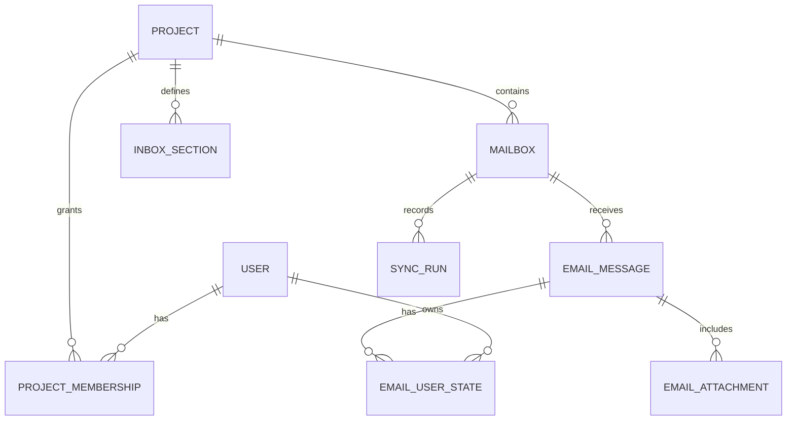

# 4. Modelo de datos

## 4.1 Relaciones principales



Se recomienda utilizar ULID como identificador de aplicación. Los nombres finales de columnas y tipos deben quedar reflejados en las migraciones.

## 4.2 `User`

| Campo | Tipo | Notas |
|---|---|---|
| `id` | ULID | Clave primaria |
| `email` | string | Único y normalizado |
| `displayName` | string | Nombre visible |
| `passwordHash` | string | Nunca exponer |
| `roles` | json | `ROLE_ADMIN` o `ROLE_USER` |
| `active` | bool | Impide acceso sin borrar historial |
| `lastLoginAt` | datetime nullable | Auditoría básica |
| `createdAt` | datetime immutable | UTC |
| `updatedAt` | datetime immutable | UTC |

## 4.3 `Project`

| Campo | Tipo | Notas |
|---|---|---|
| `id` | ULID | Clave primaria |
| `name` | string | Obligatorio |
| `slug` | string | Único |
| `description` | text nullable | Contexto interno |
| `color` | string | Color validado en formato hexadecimal |
| `icon` | string nullable | Identificador de un catálogo permitido |
| `active` | bool | Baja lógica |
| `createdAt` | datetime immutable | UTC |
| `updatedAt` | datetime immutable | UTC |

## 4.4 `ProjectMembership`

| Campo | Tipo | Notas |
|---|---|---|
| `id` | ULID | Clave primaria |
| `project` | many-to-one | Proyecto |
| `user` | many-to-one | Usuario |
| `createdAt` | datetime immutable | UTC |

Restricción única: `project_id + user_id`.

Los administradores pueden saltarse la membresía mediante autorización explícita. No se debe materializar una membresía para cada administrador.

## 4.5 `Mailbox`

| Campo | Tipo | Notas |
|---|---|---|
| `id` | ULID | Clave primaria |
| `project` | many-to-one | Proyecto propietario |
| `name` | string | Nombre visible |
| `emailAddress` | string | Dirección normalizada |
| `provider` | enum/string | Inicialmente `imap` |
| `host` | string | Host permitido |
| `port` | int | Validado |
| `encryption` | enum | `tls`, `ssl` o la opción aprobada |
| `authType` | enum | Se decidirá según proveedor |
| `username` | string | Puede coincidir con el correo |
| `encryptedSecret` | text | Cifrado en aplicación |
| `folderName` | string | Inicialmente `INBOX` |
| `enabled` | bool | Activa la sincronización |
| `status` | enum | Estado operativo |
| `uidValidity` | string nullable | Identidad de la carpeta IMAP |
| `lastUid` | string nullable | Cursor incremental |
| `lastSyncedAt` | datetime nullable | Último intento |
| `lastSuccessfulSyncAt` | datetime nullable | Última sincronización correcta |
| `lastErrorCode` | string nullable | Código sanitizado |
| `lastErrorAt` | datetime nullable | UTC |
| `createdAt` | datetime immutable | UTC |
| `updatedAt` | datetime immutable | UTC |

No se almacenará una contraseña si puede usarse OAuth. Los campos definitivos de credenciales pueden moverse a una entidad o almacén específico tras confirmar el proveedor real.

## 4.6 `EmailMessage`

| Campo | Tipo | Notas |
|---|---|---|
| `id` | ULID | Clave primaria local |
| `mailbox` | many-to-one | Cuenta de origen |
| `externalUid` | string | UID dentro de la carpeta |
| `messageId` | string nullable | Cabecera `Message-ID` normalizada |
| `inReplyTo` | string nullable | Ayuda a enlazar conversaciones |
| `references` | json nullable | IDs referenciados |
| `threadKey` | string nullable | Agrupación calculada, no identidad |
| `subject` | text | Puede quedar vacío tras normalizar |
| `senderName` | string nullable | Nombre mostrado |
| `senderAddress` | string nullable | Dirección normalizada |
| `toRecipients` | json | Lista de nombre y dirección |
| `ccRecipients` | json | Lista de nombre y dirección |
| `replyToRecipients` | json | Lista de nombre y dirección |
| `textBody` | text nullable | Texto normalizado |
| `htmlBody` | text nullable | Original controlado; nunca renderizar directamente |
| `sanitizedHtmlBody` | text nullable | Resultado seguro para la vista |
| `preview` | string | Extracto sin HTML |
| `sentAt` | datetime nullable | Fecha declarada por el mensaje |
| `receivedAt` | datetime | Fecha utilizada para ordenar |
| `importance` | enum | Baja, normal o alta |
| `remoteFlags` | json | Instantánea informativa |
| `hasAttachments` | bool | Campo derivado indexado |
| `sizeBytes` | bigint nullable | Tamaño remoto/local |
| `rawHeaders` | json nullable | Solo cabeceras permitidas |
| `fingerprint` | string | Respaldo para deduplicación |
| `synchronizedAt` | datetime immutable | UTC |
| `createdAt` | datetime immutable | UTC |
| `updatedAt` | datetime immutable | UTC |

Restricción única principal: `mailbox_id + external_uid`.

`Message-ID` no puede asumirse siempre presente ni siempre correcto. El `fingerprint` debe calcularse de forma determinista con una combinación estable de cuenta, fecha, remitente, asunto y tamaño, y sirve como defensa adicional, no como única identidad.

Índices recomendados:

- `mailbox_id, received_at DESC`.
- `mailbox_id, sender_address`.
- `message_id`.
- `thread_key`.
- Índices de búsqueda textual según la base de datos elegida.

## 4.7 `EmailAttachment`

| Campo | Tipo | Notas |
|---|---|---|
| `id` | ULID | Clave primaria |
| `emailMessage` | many-to-one | Mensaje propietario |
| `originalName` | string | Sanitizado para mostrar |
| `contentType` | string | MIME declarado/detectado |
| `sizeBytes` | bigint | Límite configurable |
| `storageKey` | string | Ruta opaca, no pública |
| `contentId` | string nullable | Para recursos inline |
| `inline` | bool | Adjunto embebido |
| `sha256` | string | Integridad y posible deduplicación |
| `createdAt` | datetime immutable | UTC |

## 4.8 `EmailUserState`

| Campo | Tipo | Notas |
|---|---|---|
| `id` | ULID | Clave primaria |
| `emailMessage` | many-to-one | Mensaje |
| `user` | many-to-one | Propietario del estado |
| `firstViewedAt` | datetime nullable | Primera apertura |
| `reviewedAt` | datetime nullable | Revisión explícita o apertura, según decisión UX |
| `pinnedAt` | datetime nullable | Destacado personal |
| `dismissedAt` | datetime nullable | Solo si se aprueba esta función |
| `updatedAt` | datetime immutable | UTC |

Restricción única: `email_message_id + user_id`.

La ausencia de registro representa el estado inicial. No se crearán estados para todos los usuarios al importar un mensaje.

## 4.9 `InboxSection`

| Campo | Tipo | Notas |
|---|---|---|
| `id` | ULID | Clave primaria |
| `project` | many-to-one | Proyecto |
| `name` | string | Nombre visible |
| `slug` | string | Único dentro del proyecto |
| `type` | enum | `system` o `custom` |
| `icon` | string nullable | Catálogo permitido |
| `color` | string nullable | Color validado |
| `position` | int | Orden visual |
| `matchMode` | enum | `all` o `any` |
| `filterDefinition` | json | Esquema versionado |
| `enabled` | bool | Visibilidad |
| `createdAt` | datetime immutable | UTC |
| `updatedAt` | datetime immutable | UTC |

Ejemplo de filtro:

```json
{
  "version": 1,
  "conditions": [
    {"field": "subject", "operator": "contains", "value": "error"},
    {"field": "senderDomain", "operator": "equals", "value": "example.com"}
  ]
}
```

El JSON debe validarse contra un esquema de aplicación y compilarse a consultas con una lista cerrada de campos y operadores. Nunca se concatena SQL proporcionado por el usuario.

## 4.10 `SyncRun`

| Campo | Tipo | Notas |
|---|---|---|
| `id` | ULID | Clave primaria |
| `mailbox` | many-to-one | Cuenta sincronizada |
| `trigger` | enum | `scheduled`, `manual`, `initial` |
| `status` | enum | `running`, `success`, `warning`, `failed` |
| `cursorBefore` | string nullable | Diagnóstico |
| `cursorAfter` | string nullable | Diagnóstico |
| `fetchedCount` | int | Remotos procesados |
| `createdCount` | int | Nuevos locales |
| `updatedCount` | int | Actualizados |
| `skippedCount` | int | Omitidos |
| `errorCode` | string nullable | Sanitizado |
| `errorMessage` | text nullable | Sin secretos ni cuerpos |
| `startedAt` | datetime immutable | UTC |
| `finishedAt` | datetime nullable | UTC |

Los registros antiguos podrán compactarse según la política de retención.

